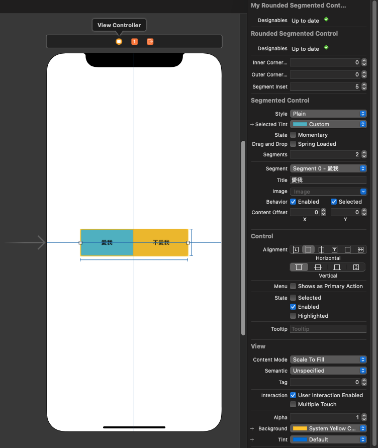
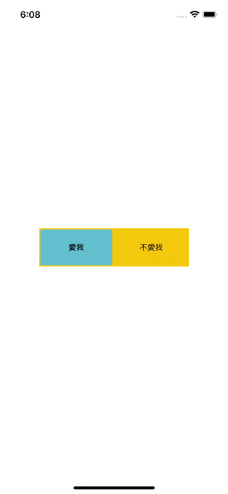

# WWRoundedSegmentedControl

[](https://developer.apple.com/swift/) [](https://developer.apple.com/swift/) [](https://developer.apple.com/swift/) [](https://developer.apple.com/swift/) 

### [Introduction - 簡介](https://swiftpackageindex.com/William-Weng)
- [Add the rounded corner function to the original UISegmentedControl.](https://useyourloaf.com/blog/replacing-ibdesignable-with-xcode-previews/)
- [將原本的UISegmentedControl，加上圓角功能。](https://developer.apple.com/documentation/xcode-release-notes/xcode-16-release-notes#Interface-Builder)




### [Installation with Swift Package Manager](https://medium.com/彼得潘的-swift-ios-app-開發問題解答集/使用-spm-安裝第三方套件-xcode-11-新功能-2c4ffcf85b4b)
```swift
dependencies: [
    .package(url: "https://github.com/William-Weng/WWRoundedSegmentedControl.git", .upToNextMajor(from: "1.1.0"))
]
```

### Function - 可用函式
|函式|功能|
|-|-|
|change(cornerRadiusPercent:segmentInset:)|改變圓角比例跟選項間隔|
|change(innerCornerRadius:outerCornerRadius:segmentInset:)|改變圓角大小跟選項間隔|

### Example
```swift
import UIKit
import WWRoundedSegmentedControl

@IBDesignable class MyRoundedSegmentedControl: WWRoundedSegmentedControl {}

final class ViewController: UIViewController {

    @IBOutlet weak var mySegmentedControl: MyRoundedSegmentedControl!
    
    override func viewDidLoad() {
        super.viewDidLoad()
        
        DispatchQueue.main.asyncAfter(deadline: .now() + 3) { [unowned self] in
            mySegmentedControl.change(cornerRadiusPercent: 0.5, segmentInset: 5)
        }
    }
}
```
